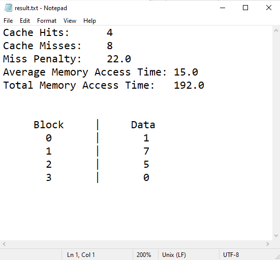

# CSARCH2-MP2 User's Manual
### The application simulates a Full Associative Cache Mapping Function with MRU (Most Recently Used) as the Replacement Algorithm. It is able to support the following:
- Sequential that runs a single time
- Sequential with loop
- Sequential with varying loops
- Sequential with single-level nested loops
- Sequential with disjointed sequences (e.g. blocks 0-5, then blocks 10-15)

### Furthermore, only the following inputs are supported:
- **Block Size**: Numbers only (words)
- **Cache Memory Size**: Numbers only (blocks or words)
- **Main Memory Size**: Numbers only (blocks or words)
- **Cache Access Time**: Numbers only (nanoseconds)
- **Main Memory Access Time**: Numbers only (nanoseconds)
- **Read Type**: Load Through / Non-load Through only
- **Sequence**: Comma-separated values (x,y,z), Range values (x-y), or a combination of both (x-y, z). Note that range values must not have space before and after the dash (blocks or addresses). Note that hex inputs are **NOT** supported.

## **Pages**
### **A. Input Page**

The user is expected to input the following information to perform the cache simulation:
1. **Block Size**: Size of a block in words.
2. **Main Memory Size**: Size of the Main Memory. May be either in blocks or words.

3. **Main Memory Access Time**: Main Memory Access Time represented in nanoseconds.
4. **Cache Memory Size**: Size of the Cache Memory Size. May be either in blocks or words.

5. **Cache Access Time**: Cache Access Time represented in nanoseconds.

6. **Read Type**: Read type of the cache. May either be Load-Through or No Load-Through.
    - **Load-Through**: The desired information can optionally be sent to the processor prior to completion of the cache line fill.
    - **No Load-Through**: The information is read from the main memory and a block or cache line is copied from the main memory onto the cache (cache line fill). The data is then transferred from the cache to the CPU.
    
7. **Next Button**: Go to the Sequence Page (Enabled once all the fields are filled)

### **B. Sequence Page**

1. **Number of Sequence Groups**: This determines the number of sequence groups in the simulation. Generally, this is useful for creating a group of sequences (where each can have varying number of loops) that will be looped *n* times; this allows support for nested loop. 

2. **Create Button**: Creates/updates number of sequence groups in the sequence group input area of the page.

3. **Input Type**: Determines whether sequence input is in terms of Blocks or Addresses

4.  **Add Sequence Button**: Adds a new sequence field in the sequence group.

5. **Remove Sequence Button**: Removes endmost sequence field in the sequence group.

6. **Number of Group Repetitions**: Determines the number of times a sequence group will loop.

7. **Sequence**: A data sequence is represented as a string of characters. One inner loop is also supported per data sequence. **Repetitions** refer to the number of times the line sequence will be looped/repeated.
  
    Examples of sequences with loops:
    
    <figure class="image">
     
    
<figcaption>Figure 1: Sample sequence pattern with one loop</figcaption>

    </figure>
    
    <figure class="image">
    
    
<figcaption>Figure 2: Sample sequence pattern with two loops</figcaption>

    </figure>

8. **Number of Sequence Repetitions**: Determines the number of times a sequence will loop.

9. **Begin Simulate**: Run simulation. 

### **C. Output Page**
Once the necessary fields have been filled up, the application will display the following information:
1. **Hit Rate**: Percentage of memory accesses found in the cache memory.
  
2. **Miss Rate**: Percentage of memory accesses not found in the cache.
  
3. **Miss Penalty**: Extra time required to fetch a block from the Main Memory into the cache memory.  

4. **Average Access Time**:  Average memory access time retrieved by the processor.
  
5. **Total Access Time**: Total memory access time with cache of the program.
  
6. **Cache Contents**: The representation of the cache memory (and its contents) in table form.

7. **Export Results Button**: Exports the result to a text file.

## **Sample Inputs**
### **A. Memory Size in Blocks**
1. Inputs for the Input Page:  
 

2. Inputs for the Sequence Page:  
 

3. Output:  

4. By clicking the Export Results button, a text file containing the results will be exported.  

### **B. Memory Size in Words**
1. Inputs for the Input Page:  
 

2. Inputs for the Sequence Page:  
 

3. Output:  

4. Contents of text file:   

## **Authors**
- [Bianca Joy Benedictos](https://www.facebook.com/biancajoyrb/)
- [Kenneth Loquinte](https://www.facebook.com/loquintek)
- [Regina Masilang](https://www.facebook.com/ReginaMasiIang/)
- [Mikayla Tejada](https://www.facebook.com/kikay30) 

